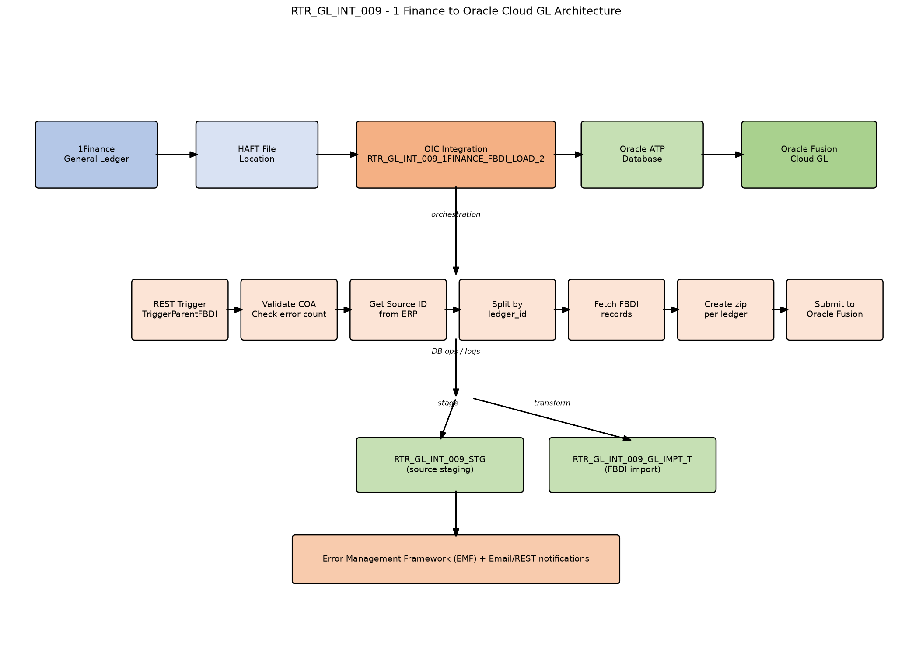

# RTR_GL_INT_009 [1Finance General Ledger to Oracle Fusion Cloud GL]

## Interface Overview

| Attribute | Value |
|---|---|
| Interface ID | RTR_GL_INT_009 |
| Source System | 1Finance General Ledger |
| Target System | Oracle Fusion Cloud General Ledger |
| Integration Pattern | FBDI (File-Based Data Import) |
| Middleware | Oracle Integration Cloud (OIC) |
| Database | Oracle Autonomous Transaction Processing (ATP) |
| Trigger | REST trigger `TriggerParentFBDI` |

## Lean Specification

1. Receive a PIPE-delimited journal entry file from 1Finance on HAFT.
2. An upstream OIC integration loads and transforms the data into FBDI format and inserts it into `RTR_GL_INT_009_STG` (Oracle ATP DB).
3. This integration, `RTR_GL_INT_009_1FINANCE_FBDI_LOAD_2`, is invoked, performs COA validation, gets an ERP source ID, splits data by `ledger_id`, and creates one FBDI zip per ledger (journal data + properties file).
4. Submit the zip to Oracle Fusion GL for journal import.
5. Import statuses are updated; errors are captured into EMF and error files are archived.
## 2.1 High-Level Architecture

1Finance GL → HAFT file location → ATP staging → FBDI import → per-ledger FBDI zip → Oracle Fusion Cloud GL

### 2.2 Overview Diagram

## E2E Process Steps with SQLs

| Step | Spec Intent | .iar Component | Connection | SQL Notes |
|---|---|---|---|---|
| Step 1: Receive Trigger | Initiate the integration | TriggerParentFBDI | RTR_OIC_REST_Connt (REST) | REST trigger. Initial variables assigned. |
| Step 2: Audit Start | Log the start of the integration run | STARTLOG | OIC Logger | No SQL; calls OIC logger integration. |
| Step 3: Read File Metadata | Get the source file name from staging | Get_FileName | RTR_ATP_DB_CONN | Get_FileName: select distinct file_name from rtr_gl_int_009_stg where OIC_INSTANCE_ID=#p_OIC_INSTANCE_ID |
| Step 4: Check COA Mapping Errors | Validate COA mapping before processing | GetProcessingStatus | RTR_ATP_DB_CONN | GetProcessingStatus: SELECT count(*) FROM RTR_GL_COA_MAPPING_STG where oic_instance_id =#oic_instance_id and SUBSTR(TARGET_COA, 5, 1) != '-' |
| Step 5: Read COA Error Segments | Read invalid COA records for error file generation | ReadCoaErrorSegment | RTR_ATP_DB_CONN | ReadCoaErrorSegment: SELECT <<columns>> FROM RTR_GL_COA_MAPPING_STG where OIC_INSTANCE_ID=#P_OIC_INSTANCE_ID and SUBSTR(TARGET_COA, 5, 1) != '-' |
| Step 6: Read File Name for Error Output | Get the file name for COA error output | ReadFileName | RTR_ATP_DB_CONN | ReadFileName: select DISTINCT FILE_NAME from RTR_GL_INT_009_STG where OIC_INSTANCE_ID=#poicinstanceid |
| Step 7: Write COA Error File | Write COA error segment to stage file | WriteCoaErrorSegments | OIC Stage File | No SQL; writes stage file. |
| Step 8: Email COA Error Notification | Notify on COA validation failure | EmailCoaErrorNotification | RTR_OIC_REST_Connt (REST) | No SQL; REST/Email call. Integration stops after this. |
| Step 9: Count Source and Stage Records | Count source import and staging records | Get_RecordsCount, GetStageRecordCount | RTR_ATP_DB_CONN | Get_RecordsCount: select count(*) from rtr_gl_int_009_gl_impt_t where oic_instance_id = #P_oic_instance_id ; GetStageRecordCount: select count(*) from rtr_gl_int_009_stg where oic_instance_id = #P_oic_instance_id |
| Step 10: Get ERP Source ID | Obtain a source ID from ERP for the import | GetSourceID | RTR_ERP_REST_CONN (REST) | No SQL; REST call. Retry loop with vRetryCount / vRetryMaxCount. |
| Step 11: Get Distinct Ledgers | Identify each ledger to process | DistinctLedgers | RTR_ATP_DB_CONN | DistinctLedgers: SELECT DISTINCT LEDGER_ID, LEDGER_NAME, ACCESS_SET_ID FROM RTR_GL_INT_009_GL_IMPT_T WHERE ((OIC_INSTANCE_ID = #P_OIC_INSTANCE_ID) AND (PROCESS_STATUS = #P_RECORD_STATUS)) |
| Step 12: Get Group ID | Generate or retrieve a group ID for the ledger batch | GetGroupId | RTR_ATP_DB_CONN | GetGroupId: select RTR_GL_INT_009_GROUPID_S.NEXTVAL AS group_id from dual |
| Step 13: Update Group ID | Store the group ID against the ledger records | Update_Group_Id | RTR_ATP_DB_CONN | Update_Group_Id: UPDATE RTR_GL_INT_009_GL_IMPT_T SET GROUP_ID = #P_GROUP_ID WHERE OIC_INSTANCE_ID = #P_OIC_INSTANCE_ID AND LEDGER_ID = #P_LEDGER_ID |
| Step 14: Get Ledger Record Count | Count records for the current ledger | GetLederRecordCount | RTR_ATP_DB_CONN | GetLederRecordCount: select count(*) from rtr_gl_int_009_gl_impt_t where oic_instance_id = #oic_instance_id and ledger_name=#ledger_name |
| Step 15: Get Min and Max Record ID | Determine the batch window for the ledger | GetMinandMaxRecordID | RTR_ATP_DB_CONN | GetMinandMaxRecordID: select max(record_id)max, min(record_id) from RTR_GL_INT_009_GL_IMPT_T where ledger_name=#p_ledger_name and oic_instance_id=#p_instance_id |
| Step 16: Fetch FBDI Records in Batches | Read FBDI-formatted records in chunks | GetFBDIRecords | RTR_ATP_DB_CONN | GetFBDIRecords: SELECT <<columns>> FROM RTR_GL_INT_009_GL_IMPT_T WHERE LEDGER_ID = #pledgerid and OIC_INSTANCE_ID = #OIC_INSTANCE_ID and RECORD_ID >= #p_start_id and RECORD_ID<=#p_end_id ORDER BY RECORD_ID ASC |
| Step 17: Create FBDI Import Zip | Build import zip per ledger | Write_FBDI_Files, WritePropertiesFile, Zip | OIC Stage File | No SQL; writes data file, properties file, and zips them. |
| Step 18: Submit to Oracle Fusion | Import journals into Oracle GL | ERPCall | RTR_ERP_CONN_PUBLIC (Oracle ERP Cloud) | No SQL; submits zip via ERP FBDI service. |
| Step 19: Update Import Job ID | Track ERP import job ID | Update_JobId | RTR_ATP_DB_CONN | Update_JobId: UPDATE RTR_GL_INT_009_GL_IMPT_T SET LOAD_REQUEST_ID = #P_IMP__REQ_ID, PROCESS_STATUS = 'UPLOADED' WHERE OIC_INSTANCE_ID = #P_OIC_INSTANCE_ID AND LEDGER_ID = #P_LEDGER_ID AND GROUP_ID=#P_GROUP_ID |
| Step 20: Update Ledger Error Status | Mark ledger import as rejected on ERP error | UpdateTxnTableLedger | RTR_ATP_DB_CONN | UpdateTxnTableLedger: UPDATE RTR_GL_INT_009_GL_IMPT_T SET PROCESS_STATUS='REJECTED-OIC-ERROR' , STATUS_MESSAGE = #STATUS_MESSAGE WHERE OIC_INSTANCE_ID = #oic_instance_id and ledger_id=#p_ledger_id |
| Step 21: Update Error Status in Staging | Mark source staging records as error | Update_Error_Status_Stg | RTR_ATP_DB_CONN | Update_Error_Status_Stg: UPDATE RTR_GL_INT_009_STG SET PROCESSED_STATUS='ERROR' WHERE OIC_INSTANCE_ID = #oic_instance_id and ledger_name = #ledgername |
| Step 22: Update Transaction Error Total | Set import table process status to error | ErrorUpdateTxnTbl | RTR_ATP_DB_CONN | ErrorUpdateTxnTbl: UPDATE RTR_GL_INT_009_GL_IMPT_T SET PROCESS_STATUS = #ERR , STATUS_MESSAGE = #STATUS_MESSAGE WHERE OIC_INSTANCE_ID = #oic_instance_id |
| Step 23: Update Staging Error Total | Set staging process status and error message | ErrorUpdateSTGTabletotal | RTR_ATP_DB_CONN | ErrorUpdateSTGTabletotal: UPDATE RTR_GL_INT_009_STG SET PROCESSED_STATUS='ERROR' ,ERROR_MESSAGE = #ERROR_MESSAGE WHERE OIC_INSTANCE_ID = #oic_instance_id |
| Step 24: Get Error Record Range | Find min/max record IDs for error output | GetErrorRecordsMinMaxRecordID | RTR_ATP_DB_CONN | GetErrorRecordsMinMaxRecordID: select max(record_id)max, min(record_id) from RTR_GL_INT_009_STG where oic_instance_id=#p_instance_id and PROCESSED_STATUS ='ERROR' |
| Step 25: Count Error Records | Count records to generate error file | CountOfErrorRecordsFromStgTable | RTR_ATP_DB_CONN | CountOfErrorRecordsFromStgTable: select count(*) from RTR_GL_INT_009_STG where oic_instance_id=#p_instance_id and PROCESSED_STATUS ='ERROR' |
| Step 26: Fetch Error Records | Read error records for the error file | ErrorRecordsFromStgTable | RTR_ATP_DB_CONN | ErrorRecordsFromStgTable: SELECT <<columns>> FROM RTR_GL_INT_009_STG WHERE OIC_INSTANCE_ID=#POICInstanceID and PROCESSED_STATUS = 'ERROR' and RECORD_ID >= #p_start_id and RECORD_ID<=#p_end_id ORDER BY RECORD_ID ASC |
| Step 27: Write and Archive Error File | Generate and archive ledger error file | WriteErrorFileForLedger, AppendFooterline, ArchiveLedgerErrorFile | OIC Stage + RTR_OIC_REST_Connt (REST) | No SQL; writes stage file and archives via REST. |
| Step 28: Global Fault Handler | Catch unhandled exceptions and update fault status | UpdateGblFaluts | RTR_ATP_DB_CONN | UpdateGblFaluts: UPDATE RTR_GL_INT_009_STG SET LAST_UPDATE_DATE=#lud,LAST_UPDATE_BY=#luser,PROCESSED_STATUS = #status,ERROR_Message=#ERR WHERE OIC_INSTANCE_ID = #oic_instance_id |
| Step 29: Completion | Log end and stop the integration | END_LOG | OIC Logger | No SQL; final log and stop. |

## Key Tables and Stage Files

| Table / File | Purpose |
|---|---|
| RTR_GL_INT_009_STG | Raw journal data staged from the source file. |
| RTR_GL_COA_MAPPING_STG | COA mapping validation table. |
| RTR_GL_INT_009_GL_IMPT_T | FBDI-formatted journal import table. |
| GL_IMPORT_1FIN_LEDGER_ID_GROUP_ID.zip | Final FBDI zip submitted to Fusion GL. |
| FBDI data file | Content produced by Write_FBDI_Files. |
| FBDI properties file | Metadata produced by WritePropertiesFile. |
| COA error file | Output of WriteCoaErrorSegments. |
| Ledger error file | Output of WriteErrorFileForLedger + AppendFooterline. |

## Important Variables

| Variable | Purpose |
|---|---|
| vSTPFileDirectory, vFilename | Source file location and name |
| vSourceID | ERP source identifier |
| vRetryCount / vRetryMaxCount / vWaitTime | Retry control |
| vMinRecordID / vMaxRecordID / vStartID / vEndID | Batch processing window |
| Error_flag, vStatusCode, vStatusMessage | Error and status tracking |

## Error Handling Matrix

| Error Scenario | Stage | Components Involved | Action |
|---|---|---|---|
| COA validation fails | Initial | ReadCoaErrorSegment, WriteCoaErrorSegments, EmailCoaErrorNotification | Write error file, email, stop integration |
| ERP source ID failure | Before ledger loop | GetSourceID, vRetryCount, vWaitTime | Retry up to max; throw fault if exceeded |
| FBDI import failure | Ledger processing | UpdateTxnTableLedger, Update_Error_Status_Stg, Notification_for_ledge_failure | Update error status, send notification, continue to error file generation |
| Global fault | Anywhere | UpdateGblFaluts, Notification, GlobalFault_EndLog | Log, notify, re-throw |
| Post-process error file generation | After import | GetErrorRecordsMinMaxRecordID, WriteErrorFileForLedger, ArchiveLedgerErrorFile | Generate and archive per-ledger error file |

## Notes

- The integration is **REST-triggered**, not file-triggered. The source file is likely placed on HAFT and staged in ATP by a separate upstream process.
- All data operations are grouped by ledger_id, and one FBDI zip is generated per ledger.
- Records are processed in **batches** using vStartID and vEndID windows.
- A **retry loop** is present for the ERP source ID retrieval.
- Error handling has two levels: initial COA validation that stops the flow, and ledger-level import errors that continue to the next ledger and generate error files.
## Key Terms

| Term | Meaning |
|---|---|
| FBDI | File-Based Data Import — Oracle Fusion's bulk import mechanism. |
| HAFT | File server location where source files are placed. |
| 1Finance | Dell's existing Finance/GL system of record (source). |
| Oracle Cloud GL | Oracle Fusion Cloud General Ledger (target). |
| ATP | Autonomous Transaction Processing database used for staging and tracking. |
| COA | Chart of Accounts validation. |
| OIC | Oracle Integration Cloud. |
| Source ID | Identifier retrieved from ERP to tag the import batch. |
| Group ID | Identifier generated per ledger batch to group related records. |
