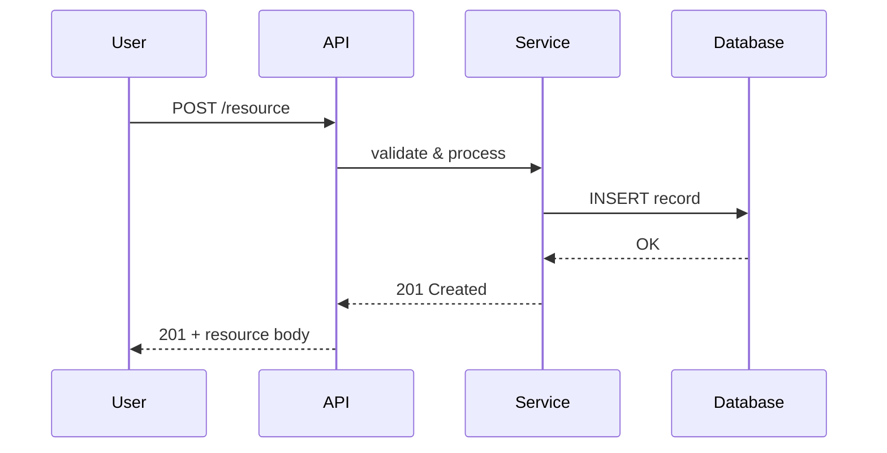
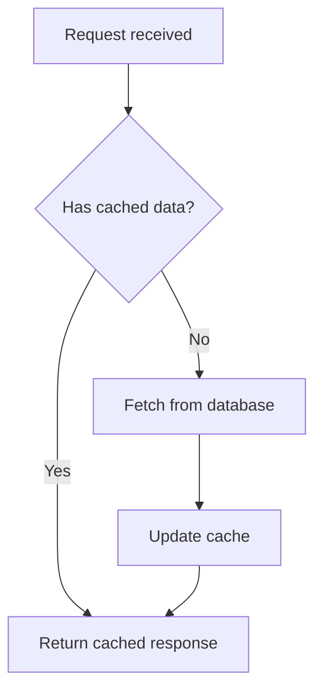
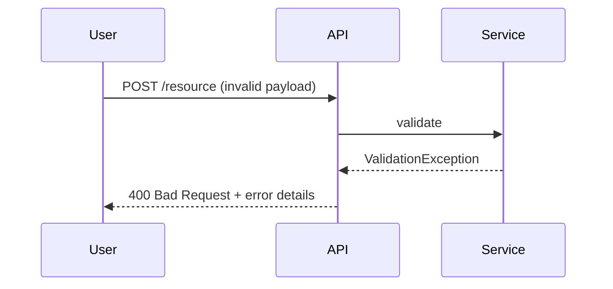
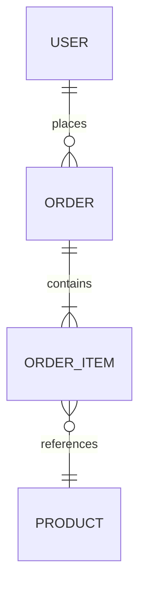
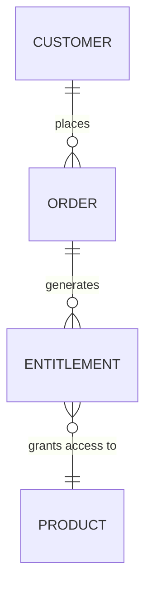
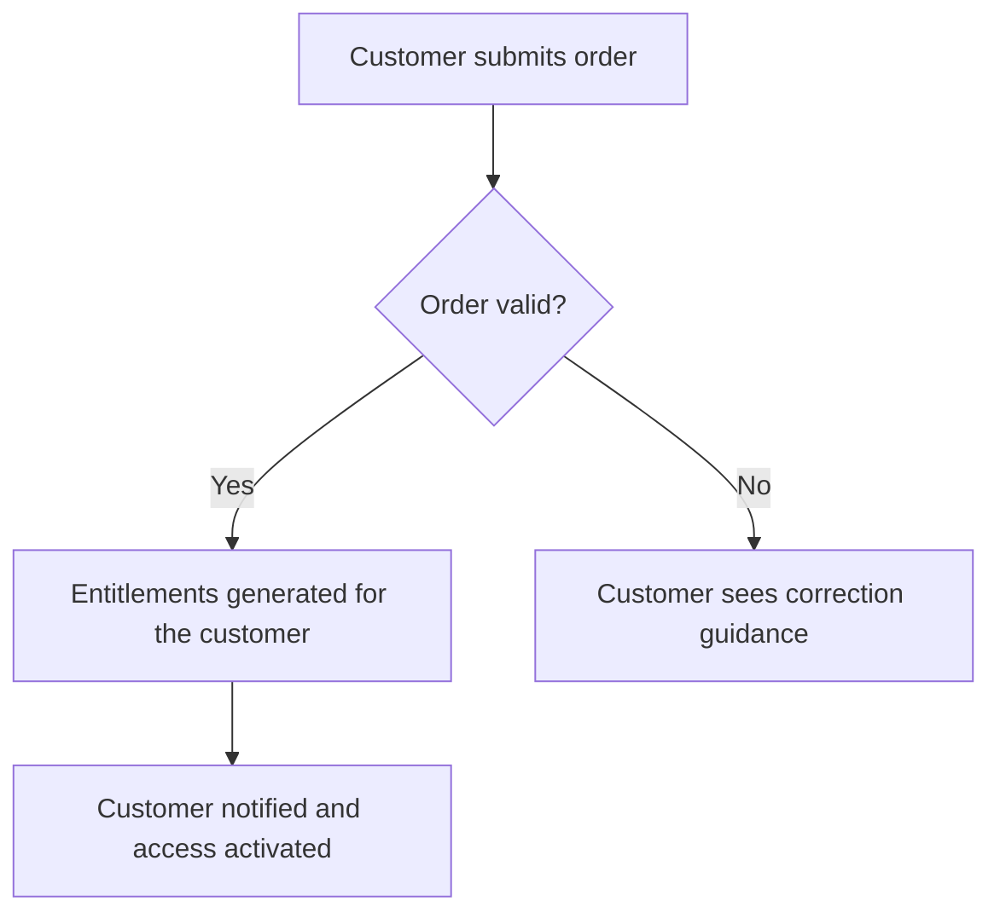

# create-pod-knowledge

> Generate a **mandatory** `POD.md` executive summary of the POD, plus comprehensive app specification documents (functional, technical, data model, API, integration, security, deployment, NFR) by analyzing the workspace's codebase. Optionally generates an `AGENTS.md` workspace context file and a `LEARNINGS.md` secondary memory template.

---

## Purpose

This skill analyses a workspace's codebase — its Git projects, languages, frameworks, modules, configuration, tests, and documentation — and produces up to eight specification documents that fully describe the project. Each spec is written as a standalone Markdown file in `ai/knowledge/` (or a user-chosen directory). Human-written documentation (domain guides, architecture docs, requirements, onboarding material, etc.) lives in `ai/raw/` and is automatically loaded as input context during knowledge generation, enriching the AI-derived specs with business and domain understanding.

Additionally, it can generate an `AGENTS.md` file at the workspace root that serves as the primary context document for AI agents and a `LEARNINGS.md` template for persistent cross-session memory.

Supported spec types:

1. **POD.md** — concise executive summary of the POD's purpose, sub-domain, business entities, and flows (readable in 10–15 minutes). **Always generated at `ai/knowledge/POD.md` — mandatory. Never at the workspace root.**
2. **Functional Specs** — includes functional flows and variations as Mermaid diagrams
3. **Technical Specs**
4. **Data Model Specs**
5. **API Specs**
6. **Integration Specs**
7. **Security Specs**
8. **Deployment / Infrastructure Specs**
9. **Non-Functional Requirements (NFR) Specs**

Additional outputs:

10. **AGENTS.md** — workspace context file for AI agents
11. **LEARNINGS.md** — secondary memory template

---

## Prerequisites

- The current working directory is the root of a workspace containing one or more Git repositories (or a single repo root).
- The repository/repositories contain source code, configuration, and/or documentation to analyse.
- Write access to the output directory (default `ai/knowledge/`).
- Optional: Human-written documentation in `ai/raw/` (domain guides, architecture docs, requirements docs, onboarding material). If present, these are automatically loaded as additional context. **If `ai/raw/` is empty or does not exist, the skill proceeds normally — all specs are derived entirely from codebase analysis.**

---

## Workflow Steps

### Step 1 — Collect Functional Documentation References

Before analysing code, check for human-written documentation in `ai/raw/` and ask the user whether they have any additional documentation that should be used as reference material for generating the specs. This ensures the specs incorporate domain knowledge that may not be directly visible in the codebase.

**1.1 — Load `ai/raw/` (Primary Default Location)**

The `ai/raw/` directory is the designated location for human-authored reference material that enriches the AI-generated knowledge. Check if it exists and load any files found there. **If `ai/raw/` is empty or absent, skip this sub-step silently and continue — codebase analysis alone is sufficient to generate all specs.**

```bash
# Check if ai/raw/ exists and list its contents
if [ -d "ai/raw" ]; then
  find ai/raw/ -type f \( -name "*.md" -o -name "*.txt" -o -name "*.pdf" -o -name "*.docx" -o -name "*.adoc" -o -name "*.rst" \) | sort
fi
```

Expected types of documents in `ai/raw/`:
- **Domain guides** — business domain overviews, glossaries, domain model descriptions
- **Architecture docs** — high-level architecture decisions, system context diagrams, ADRs
- **Requirements docs** — PRDs, functional requirements, user stories, acceptance criteria
- **Onboarding docs** — team onboarding guides, developer setup guides, coding conventions
- **API documentation** — external API references, integration guides, contract specs
- **UI/UX designs** — Figma exports, wireframes, mockups, screen flows, design system documentation (for UI applications)
- **Any other human-written reference material** — meeting notes, design proposals, technical RFCs

If `ai/raw/` exists and contains files, read all files and store their content as documentation context. These are human-authored inputs — treat them as high-value domain context for enriching the generated specs. If `ai/raw/` does not exist or is empty, proceed without it — this is a normal and fully supported scenario.

**1.2 — Ask the User for Additional Documentation**

Prompt the user:

> Do you have any existing functional or technical documentation that I should reference while generating the POD Knowledge? This could include:
>
> - Confluence pages (provide URLs)
> - Internal wiki pages
> - Requirements documents or PRDs
> - Architecture decision records (ADRs)
> - Existing spec files or design documents in the repo
> - API documentation (Swagger/OpenAPI files)
> - Figma designs (provide Figma URLs or exported images/PDFs — for UI applications)
> - Domain guides or onboarding docs
> - Any other reference material
>
> **Note:** I have already loaded any documents found in `ai/raw/` (the designated directory for human-written input docs). You can add more files there at any time.
>
> If you provide URLs, I will fetch and incorporate them. If you have local files, please provide the file paths.
>
> If none are available (and `ai/raw/` is empty or absent), I will derive the specs entirely from codebase analysis.

**1.3 — Load Additional Documentation**

For each additional documentation source the user provides:

- **URLs (Confluence, wiki, etc.)**: Fetch the page content and extract the relevant information. If authentication is required, check `local.config` for the appropriate PAT (e.g., `CONFLUENCE_PAT`).
- **Figma URLs**: If the user provides Figma links, attempt to fetch the page and extract visual context (component names, screen names, layout descriptions). If the Figma URL is not publicly accessible, ask the user to export the relevant frames as images or PDFs and place them in `ai/raw/`. Describe the UI structure, components, navigation flows, and design patterns visible in the designs.
- **Local file paths**: Read the files and extract relevant content.
- **Existing repo files**: If the user points to files already in the repo (e.g., `docs/`, `README.md`, existing specs), read them.
- **None provided**: Note that specs will be derived purely from codebase analysis (plus any `ai/raw/` content already loaded) and proceed.

Store all loaded documentation context (from `ai/raw/` and user-provided sources) for reference during spec generation in subsequent steps.

**1.4 — Summarise Loaded Context**

If documentation was provided (from `ai/raw/` and/or user-provided sources), present a brief summary:

```
=== Documentation Context Loaded ===

From ai/raw/ (human-authored input docs):
  1. [ai/raw] domain-overview.md — 1,200 words
  2. [ai/raw] architecture-decisions.md — 950 words
  3. [ai/raw] onboarding-guide.md — 2,100 words

Additional sources:
  4. [Confluence] "DL Guide - Architecture Overview" — 2,450 words
  5. [Local file] docs/domain-model.md — 890 words
  6. [Repo file] README.md — 340 words

These will be cross-referenced with codebase analysis during spec generation.
```

If no documentation was provided and `ai/raw/` is empty or absent, confirm and **proceed immediately without waiting**:

```
No external documentation provided and ai/raw/ is empty or not present. Specs will be derived entirely from codebase analysis. Proceeding.
```

### Step 2 — Discover & Confirm Workspace Git Projects

Before diving into project structure, identify all Git repositories in the workspace and present them to the user for confirmation.

**2.1 — Scan for Git Repositories**

```bash
# Find all Git repositories in the workspace (top-level directories containing .git)
for dir in */; do
  if [ -d "$dir/.git" ]; then
    echo "$dir"
  fi
done
```

For each discovered Git repository, collect:

| Field | How to Detect |
|-------|---------------|
| **Project name** | Directory name |
| **Remote URL** | `git -C <dir> remote get-url origin 2>/dev/null` |
| **Current branch** | `git -C <dir> branch --show-current` |
| **Last commit** | `git -C <dir> log -1 --format="%h %s" 2>/dev/null` |
| **Primary language** | Scan for `pom.xml` (Java), `package.json` (Node.js), `Cargo.toml` (Rust), `go.mod` (Go), `requirements.txt`/`pyproject.toml` (Python), `CMakeLists.txt` (C/C++), etc. |
| **Framework** | Parse build files for framework indicators (Spring Boot, React, NestJS, Django, etc.) |
| **Build tool** | Maven, Gradle, npm, cargo, make, etc. |
| **Module count** | Count sub-modules (e.g., `pom.xml` modules, workspace packages) |
| **Has tests** | Check for test directories |
| **Description** | Parse from `README.md` first line or project description in build file |

**2.2 — Present Project Inventory to User**

Display the discovered projects in a table and ask the user to confirm:

```
=== Workspace Git Projects ===

Found N Git repositories in the workspace:

| # | Project           | Language   | Framework         | Build Tool | Modules | Remote                         |
|---|-------------------|------------|-------------------|------------|---------|--------------------------------|
| 1 | backend-api          | Java 21    | Spring Boot 3.5.6 | Maven      | 14      | git.example.com/.../backend-api   |
| 2 | integration-service  | Python 3.12| FastAPI 0.104      | pip        | 3       | git.example.com/.../integration   |
| 3 | query-service        | TypeScript | NestJS 10.x       | npm        | 5       | git.example.com/.../query-svc     |
| ...                                                                                                                |

(These are examples — the skill auto-detects the project's actual technology stack)

Which projects should I include in the spec generation?
  [A] All projects (default)
  [B] Select specific projects (provide numbers)
  [C] Exclude specific projects (provide numbers)

Also: should I generate the AGENTS.md workspace context file? (default: yes)
```

**2.3 — Record Confirmed Scope**

Store the user's selection. Only analyse confirmed projects in subsequent steps. If the user added or removed projects, respect their choices.

### Step 3 — Discover Project Structure

For each confirmed project, scan to build a comprehensive understanding before generating specs.

**3.1 — Languages & Frameworks**

```bash
# Identify primary languages by file extension counts
find . -type f | sed 's/.*\.//' | sort | uniq -c | sort -rn | head -20

# Look for framework indicators
cat pom.xml package.json build.gradle settings.gradle requirements.txt Gemfile go.mod Cargo.toml 2>/dev/null
```

**3.2 — Module / Package Layout**

```bash
# Map top-level and second-level directory structure
find . -maxdepth 2 -type d | grep -v '\.git' | sort

# For Java/Kotlin projects, list all modules
find . -name "pom.xml" -o -name "build.gradle" | sort
```

**3.3 — Configuration Files**

Locate and read all configuration files: `application.yml`, `application.properties`, `.env`, `docker-compose.yml`, `Dockerfile`, `Makefile`, CI/CD pipelines (`.gitlab-ci.yml`, `.github/workflows/`), Kubernetes manifests, Terraform files, etc.

**3.4 — Tests**

```bash
# Find test directories and count test files
find . -type d -name "test" -o -type d -name "tests" -o -type d -name "__tests__" -o -type d -name "spec" | sort
find . -type f -name "*Test.*" -o -name "*Spec.*" -o -name "test_*" -o -name "*.test.*" | wc -l
```

**3.5 — Existing Documentation**

```bash
# Check for existing docs
find . -type f -name "*.md" -o -name "*.adoc" -o -name "*.rst" | grep -iv changelog | sort
ls -la docs/ doc/ ai/ 2>/dev/null
```

**3.6 — Build a Mental Model**

From the above, determine:
- Primary language(s) and framework(s)
- Architectural style (monolith, microservice, modular monolith, library, CLI tool, etc.)
- Key modules/packages and their responsibilities
- External dependencies (databases, message brokers, external APIs, cloud services)
- Build system and toolchain
- Test strategy (unit, integration, e2e)

Cross-reference with any documentation loaded in Step 1 to enrich understanding.

### Step 4 — Ask User Which Specs to Generate

`POD.md` is a **mandatory** output — it is the executive-level summary of what this POD does and is the first file anyone reads to understand the POD. It is always generated at **`ai/knowledge/POD.md`** (inside the knowledge output directory) and cannot be skipped. It is **never** written at the workspace root — it is a knowledge spec, not a workspace-context file like `AGENTS.md`.

Present the list of eight detailed spec types and ask the user which ones to generate. **Default: all eight.**

Also ask for the output directory. **Default: `ai/knowledge/`.**

Also confirm whether to generate:
- **AGENTS.md** at the workspace root (default: yes)
- **LEARNINGS.md** template (default: yes, if it doesn't already exist)

```bash
# Create the output directory
mkdir -p ai/knowledge
```

If the user requests only a subset of the eight detailed specs, skip the corresponding steps below. **`POD.md` is still generated regardless** — it is a required deliverable of this skill.

### Step 5 — Generate Functional Specs

**Output file:** `{output_dir}/functional-spec.md`

Analyse the codebase to identify actors, features, use cases, business rules, and functional flows. If documentation was loaded from Step 1, cross-reference it to enrich the output — but the codebase is always the primary source and is sufficient on its own. Write the spec with the following sections:

**5.1 — Overview**
- Project name and one-paragraph summary of what the system does.
- High-level goals and scope.

**5.2 — Actors / Personas**
- List every actor that interacts with the system (end users, admins, external systems, scheduled jobs, etc.).
- For each actor: name, description, and key interactions.

**5.3 — Features & Use Cases**
- Group features by domain area or module.
- For each feature:
  - **Feature name**
  - **Description** — what it does from the user's perspective.
  - **Actors involved**
  - **Preconditions**
  - **Postconditions / Expected outcomes**
  - **Use cases** — numbered list of specific scenarios (UC-001, UC-002, etc.).

**5.4 — Business Rules**
- Extract business rules from the code (validation logic, state machines, conditional branches, access control rules).
- Number each rule (BR-001, BR-002, etc.) with a clear description.

**5.5 — Functional Flows**
This section is critical. For every significant feature or use case, produce **Mermaid diagrams** showing the flow.

**5.5.1 — Happy-Path Flows**
For each major flow, create a Mermaid `sequenceDiagram` or `flowchart` showing the normal/successful path:

````markdown

````

**5.5.2 — Variation Flows**
For each happy-path flow, identify variations (alternate paths that still succeed but take a different route):

````markdown

````

**5.5.3 — Error Flows**
For each flow, identify error/exception paths and diagram them:

````markdown

````

**Formatting rules for Mermaid diagrams:**
- Use `sequenceDiagram` for request/response flows between components.
- Use `flowchart TD` (top-down) for decision trees and branching logic.
- Use `stateDiagram-v2` for state machine / lifecycle flows.
- Label every arrow with the action or message.
- Keep diagrams focused — one flow per diagram, not the entire system.
- Use participant aliases to keep diagrams readable.

### Step 6 — Generate Technical Specs

**Output file:** `{output_dir}/technical-spec.md`

**6.1 — Architecture Overview**
- Architectural style (microservices, modular monolith, etc.).
- High-level component diagram (as Mermaid `flowchart` or `C4Context`).
- Key design decisions and patterns used (CQRS, event sourcing, hexagonal, etc.).

**6.2 — Technology Stack**

| Layer | Technology | Version | Notes |
|---|---|---|---|
| Language | e.g. Java | 17 | From `pom.xml` / `build.gradle` |
| Framework | e.g. Spring Boot | 3.x | From dependencies |
| Database | e.g. PostgreSQL | 15 | From config / docker-compose |
| ... | ... | ... | ... |

**6.3 — Module Breakdown**
For each module/package:
- Name and responsibility.
- Key classes/files and their roles.
- Dependencies on other modules.
- Public API surface.

**6.4 — Control Flow**
Trace the request lifecycle from entry point to response:
- HTTP request handling -> controller/handler -> service -> repository -> response.
- Message consumption -> handler -> processing -> acknowledgement.
- Scheduled job -> trigger -> processing -> completion.

**6.5 — Error Handling Strategy**
- Global exception handlers.
- Error response format.
- Retry policies.
- Dead-letter queues / fallback mechanisms.

**6.6 — Configuration Management**
- Configuration sources (files, environment variables, config server).
- Key configuration properties and their purpose.
- Environment-specific overrides.

**6.7 — Testing Strategy**
- Unit test framework and patterns.
- Integration test setup (testcontainers, embedded databases, etc.).
- Test coverage areas and any gaps identified.

### Step 7 — Generate Data Model Specs

**Output file:** `{output_dir}/data-model-spec.md`

**7.1 — Entities / Tables**
For each entity:
- Entity/table name.
- All fields: name, type, constraints (NOT NULL, UNIQUE, DEFAULT, etc.).
- Primary key.
- Description of what the entity represents.

**7.2 — Relationships**
- All foreign keys and associations.
- Cardinality (one-to-one, one-to-many, many-to-many).
- Join tables if applicable.
- Mermaid `erDiagram` showing all entities and relationships:

````markdown

````

**7.3 — Indexes**
- All declared indexes (from entity annotations, migration scripts, or DDL).
- Composite indexes.
- Unique constraints.

**7.4 — Enums & Reference Data**
- All enums used in the data model.
- Static reference data / lookup tables.

**7.5 — Migrations**
- Migration tool (Flyway, Liquibase, Alembic, etc.).
- List of migration scripts and what each one does.
- Current schema version.

**7.6 — ER Summary**
A complete Entity-Relationship diagram as a Mermaid `erDiagram` covering all entities, with field-level detail for key entities.

### Step 8 — Generate API Specs

**Output file:** `{output_dir}/api-spec.md`

**8.1 — API Overview**
- API style (REST, GraphQL, gRPC, etc.).
- Base URL / path prefix.
- Versioning strategy.
- Content types.

**8.2 — Endpoints**
For each endpoint:

| Field | Detail |
|---|---|
| **Method** | `GET`, `POST`, `PUT`, `DELETE`, `PATCH` |
| **Path** | `/api/v1/resource/:id` |
| **Description** | What this endpoint does |
| **Request headers** | Required headers (auth, content-type, custom) |
| **Path parameters** | Name, type, description |
| **Query parameters** | Name, type, required/optional, description |
| **Request body** | JSON schema or example with all fields documented |
| **Response (success)** | Status code + JSON schema or example |
| **Response (error)** | Possible error codes and their meanings |
| **Authorization** | Required roles/permissions |

**8.3 — Authentication & Authorization**
- Auth mechanism (JWT, OAuth2, API key, session, etc.).
- Token format and claims.
- How auth is enforced (filters, middleware, annotations).

**8.4 — Common Patterns**
- Pagination (format, default/max page sizes).
- Filtering and sorting conventions.
- Error response format (standard error envelope).
- Rate limiting (if applicable).

**8.5 — Outbound API Clients**
- External APIs consumed by the project.
- For each: base URL, endpoints called, auth method, retry policy.

### Step 9 — Generate Integration Specs

**Output file:** `{output_dir}/integration-spec.md`

The integration spec captures every interface the POD has with other systems. It is organised into exactly **two top-level groups**:

- **9.A — Internal Integrations** — interactions *between git repos that are part of this POD workspace* (i.e. projects listed in Step 2's workspace git projects table). Example: `backend-api` calling `query-service` over REST, both owned by this POD.
- **9.B — External Interfaces** — any interaction that *crosses the POD workspace boundary*, either inbound (consumed by other PODs or external clients) or outbound (calling systems owned by other PODs or third parties). Example: a REST endpoint exposed for another POD to consume, or a call to a vendor billing API.

> **Classification rule:** if both endpoints of an integration are owned by this POD (i.e. both repos appear in the workspace git projects table), it is **Internal**. Otherwise it is **External**. When in doubt, default to **External** and flag for review.

Every entry under either group must record the **integration type** (sync REST/gRPC, async message, shared DB, batch/ETL, file transfer, etc.) and **direction** (inbound or outbound, from this POD's perspective).

---

#### 9.A — Internal Integrations

Interactions between git repos inside this POD workspace. For each one, record: *source repo → target repo*, integration type, protocol, and purpose.

**9.A.1 — Synchronous (REST / gRPC / in-process)**
- Calling service and called service (both from this POD).
- Endpoint/method invoked, auth mechanism, timeout and retry configuration, circuit breaker settings.

**9.A.2 — Messaging & Events (internal topics/queues)**
- Producer repo and consumer repo (both from this POD).
- Broker and topic/queue name, message schema/format, consumer-group config, ordering and idempotency guarantees, dead-letter handling.

**9.A.3 — Shared Data Stores**
- Databases, caches, object stores, or search indexes shared across multiple POD repos.
- Which repos read, which write, schema ownership, access patterns, and coupling risks.

**9.A.4 — Internal Batch / ETL**
- Scheduled jobs that move data between POD repos.
- Source, target, cadence, volume, consistency strategy (eventual, transactional, saga).

---

#### 9.B — External Interfaces

Anything crossing the POD workspace boundary. For each entry, record **direction** (`inbound` = into this POD; `outbound` = out of this POD), the counterparty system/POD, and the ownership boundary.

**9.B.1 — Inbound Synchronous APIs (exposed by this POD)**
- REST/gRPC endpoints this POD exposes for external consumers.
- Consumers (known POD names, external clients, or partner systems), auth & authorisation, SLAs, rate limits, versioning policy.
- Cross-reference `api-spec.md` for request/response schemas.

**9.B.2 — Outbound Synchronous Calls (this POD → external)**
- REST/gRPC/SOAP calls this POD makes to systems outside the workspace.
- Target system name, owner (other POD or third party), integration type, auth, connection config (with secrets redacted), timeout/retry/circuit-breaker config, failure handling.

**9.B.3 — Inbound Messaging (this POD consumes externally-published events)**
- External producer (other POD or third party), broker, topic, schema, consumer group, ordering/idempotency, DLQ strategy.

**9.B.4 — Outbound Messaging (this POD publishes events consumed externally)**
- Broker, topic, schema, publication cadence, known consumers, retention, contract versioning.

**9.B.5 — External Batch / ETL / File Transfer**
- Scheduled data exchanges with external systems (SFTP, S3, MFT, etc.).
- Direction, cadence, file format, volume, encryption, checksum/validation, failure handling.

**9.B.6 — Third-Party Dependencies**
- Vendor APIs, SaaS products, infrastructure services (DNS, secrets, observability, CDN, etc.) this POD depends on.
- Contract/SLA, environment-specific endpoints, credential rotation policy.

---

#### 9.C — Summary Tables

Include two consolidated tables at the top of the spec for quick reference:

```markdown
### Internal Integrations — Summary

| Source Repo | Target Repo | Type | Protocol | Purpose |
|-------------|-------------|------|----------|---------|
| backend-api | query-service | Sync | REST | Read-model queries |
| ... | ... | ... | ... | ... |

### External Interfaces — Summary

| Direction | Counterparty | Owner | Type | Protocol | Purpose |
|-----------|--------------|-------|------|----------|---------|
| inbound   | POD-orders   | Other POD | Sync  | REST   | Order lookup |
| outbound  | Stripe       | Third-party | Sync | REST | Payment capture |
| outbound  | POD-audit    | Other POD | Async | Kafka  | Emit audit events |
| ... | ... | ... | ... | ... | ... |
```

Any existing integration that does not cleanly fit the new grouping must be placed under the closest sub-section; if truly ambiguous, default it to **External** and add a `TODO: Confirm ownership boundary with team` note.

### Step 10 — Generate Security Specs

**Output file:** `{output_dir}/security-spec.md`

**10.1 — Authentication**
- Authentication mechanism and flow.
- Identity provider(s).
- Token lifecycle (issuance, validation, refresh, revocation).
- Session management (if applicable).

**10.2 — Authorization**
- Authorization model (RBAC, ABAC, ACL, etc.).
- Roles and permissions defined in the system.
- How authorization is enforced (annotations, middleware, policy engine).
- Resource-level access control.

**10.3 — Data Protection**
- Encryption at rest (database encryption, encrypted columns).
- Encryption in transit (TLS configuration).
- Sensitive data handling (PII masking, audit logging redaction).
- Secrets management (vault, environment variables, sealed secrets).

**10.4 — Security Dependencies**
- Security libraries used (Spring Security, Passport.js, etc.).
- Known security configurations (CORS, CSP, CSRF protection).
- Input validation and sanitisation approach.
- Dependency vulnerability scanning (if configured).

### Step 11 — Generate Deployment Specs

**Output file:** `{output_dir}/deployment-spec.md`

**11.1 — Build & Package**
- Build tool and commands.
- Artifact type (JAR, WAR, Docker image, npm package, binary, etc.).
- Build profiles / configurations.

**11.2 — Containerisation**
- Dockerfile analysis (base image, layers, exposed ports, entrypoint).
- Docker Compose setup (services, networks, volumes).
- Image registry and tagging strategy.

**11.3 — Orchestration**
- Kubernetes manifests (Deployments, Services, ConfigMaps, Secrets, Ingress).
- Helm charts (if present).
- Resource requests/limits.
- Health checks (liveness, readiness, startup probes).
- Horizontal Pod Autoscaler configuration.

**11.4 — CI/CD Pipeline**
- Pipeline definition file and tool (GitLab CI, GitHub Actions, Jenkins, etc.).
- Pipeline stages and what each stage does.
- Deployment strategy (rolling update, blue-green, canary).
- Environment promotion flow (dev -> staging -> prod).

**11.5 — Environment Configuration**
- Environment-specific settings and how they are managed.
- Feature flags (if present).
- Infrastructure-as-code (Terraform, CloudFormation, Pulumi).

**11.6 — Observability**
- Logging framework and configuration (log levels, structured logging, log aggregation).
- Metrics collection (Prometheus, Micrometer, StatsD, etc.).
- Distributed tracing (OpenTelemetry, Jaeger, Zipkin).
- Alerting rules (if defined in code/config).
- Dashboards (Grafana, Datadog, etc.).

### Step 12 — Generate NFR Specs

**Output file:** `{output_dir}/nfr-spec.md`

**12.1 — Performance**
- Response time requirements/expectations (inferred from timeouts, SLAs in config).
- Throughput expectations (from thread pool sizes, connection pool sizes, consumer concurrency).
- Known performance optimisations (caching, connection pooling, async processing).

**12.2 — Scalability**
- Horizontal scaling capability (stateless services, HPA configuration).
- Vertical scaling considerations.
- Database scaling (read replicas, sharding, partitioning).
- Message processing scalability (consumer groups, partitions).

**12.3 — Availability**
- Deployment redundancy (replica counts, multi-AZ).
- Health check configuration.
- Graceful shutdown handling.
- Dependency failure tolerance.

**12.4 — Reliability**
- Retry mechanisms and policies.
- Circuit breaker configuration.
- Idempotency guarantees.
- Data durability (backup, replication).
- Transaction management.

**12.5 — Observability (NFR Perspective)**
- Monitoring coverage (what is monitored, what gaps exist).
- Alerting thresholds.
- Log retention policies.
- Trace sampling rates.

**12.6 — Maintainability**
- Code organisation and modularity.
- Documentation coverage.
- Test coverage.
- Dependency management (how up-to-date are dependencies).
- Code quality tools (linters, formatters, static analysis).

### Step 13 — Generate AGENTS.md

**Output file:** `AGENTS.md` at the workspace root (same level as the project directories).

If the user opted out of AGENTS.md generation in Step 4, skip this step.

Generate a comprehensive `AGENTS.md` that serves as the primary context document for AI agents (Claude, Devin, Windsurf, Cursor, Copilot, etc.) working in this workspace. The file must be derived entirely from the codebase analysis performed in earlier steps and any documentation loaded in Step 1.

**13.1 — Header & Purpose**

```markdown
# AGENTS.md — {Application Name} Workspace Context

> This file provides workspace context for AI coding agents. It is auto-generated
> by the `create-pod-knowledge` skill and should be kept up to date as the codebase evolves.

---
```

**13.2 — Workspace Overview**
- Application name and one-paragraph purpose.
- Owner / team (if identifiable from code, config, or documentation).
- Workspace structure: note that this is a multi-project workspace (if applicable) and that the workspace root is not itself a Git repository.

**13.3 — Project Inventory**

Include a table of all Git projects discovered in Step 2 (filtered by user confirmation):

```markdown
## Projects

| Project | Path | Description | Language | Framework | Build Tool |
|---------|------|-------------|----------|-----------|------------|
| backend-api | `backend-api/` | Core API service | Java 21 | Spring Boot 3.5.6 | Maven |
| ... | ... | ... | ... | ... | ... |
```

For each project, include a brief (2-3 sentence) summary of its responsibility and key modules.

**13.4 — Technology Stack**

Consolidated technology stack table covering all projects:

```markdown
## Technology Stack

| Layer | Technology | Version | Used By |
|-------|-----------|---------|---------|
| Language | Java | 21 | backend-api, integration-service, control-plane |
| ... | ... | ... | ... |
```

**13.5 — Architecture & Key Patterns**
- Architectural style(s) used across the workspace.
- Key design patterns (e.g., CQRS, event sourcing, modular monolith, outbox pattern, handler-service-repository).
- Cross-project dependencies and how changes propagate (e.g., shared model modules).

**13.6 — Build & Test Reference**

A consolidated table of build and test commands for every project:

```markdown
## Build & Test

| # | Project | Type | Command | Working Dir | Notes |
|---|---------|------|---------|-------------|-------|
| 1 | backend-api | unit | `{build_command}` (e.g., `mvn clean install`, `npm test`, `cargo build`) | `backend-api/` | Full build with tests |
| 2 | backend-api | e2e | `{e2e_test_command}` | `backend-api/` | Requires running service |
| ... | ... | ... | ... | ... | ... |
```

Include instructions for running services locally (ports, profiles, JVM args).

**13.7 — POD Knowledge Reference**

Link to each generated spec with a one-line summary:

```markdown
## Detailed Specifications

| Spec | Path | Contents |
|------|------|----------|
| POD Summary | `ai/knowledge/POD.md` | Executive overview — purpose, sub-domain, capabilities, business entities & flows (10-min read) |
| Functional Spec | `ai/knowledge/functional-spec.md` | Features, use cases, business rules, Mermaid flow diagrams |
| Technical Spec | `ai/knowledge/technical-spec.md` | Architecture, modules, tech stack, control flow |
| Data Model Spec | `ai/knowledge/data-model-spec.md` | All collections/tables, fields, indexes, ER diagrams |
| API Spec | `ai/knowledge/api-spec.md` | Every REST endpoint with request/response schemas |
| ... | ... | ... |
```

Include a "Quick Reference" guide: when to consult which spec (e.g., "Adding an API endpoint? -> api-spec.md + technical-spec.md").

> **Exclude from AGENTS.md:** `ai/knowledge/CHANGELOG.md` and `ai/knowledge/.raw-integrated.log` are provenance/audit artefacts only. They must **not** be linked, referenced, or described in AGENTS.md, and they are not consumed by feature-spec lifecycle skills (`create-specs`, `create-plan`, `execute`, `wrap-up`).

**13.8 — Constitution & Governance**

If `ai/harness/CONSTITUTION.md` exists, read it and include a summary section in AGENTS.md:

```markdown
## Constitution & Governance

This workspace has a project constitution at `ai/harness/CONSTITUTION.md` that defines non-negotiable
engineering principles, quality gates, and technology governance. **All AI agents and human
developers must comply with these rules.**

### Core Principles
{Extract and list the numbered core principles from ai/harness/CONSTITUTION.md}

### Quality Gates
{Extract and summarise the quality gates table from ai/harness/CONSTITUTION.md}

> **Full constitution:** See [`ai/harness/CONSTITUTION.md`](ai/harness/CONSTITUTION.md) for the complete
> governance document including workspace standards, feature development standards, version
> control conventions, error handling standards, and the amendment process.
>
> The `/create-plan` skill validates every feature spec and implementation plan against
> these principles. Violations block plan generation.
```

If `ai/harness/CONSTITUTION.md` does not exist, include a brief note:

```markdown
## Constitution & Governance

No project constitution found at `ai/harness/CONSTITUTION.md`. To add architectural governance
principles, create this file in the `ai/` repository. The `/create-plan` skill will
automatically validate specs and plans against it.
```

**13.9 — Git & Branching Conventions**
- Remote URL pattern (inferred from Git remotes).
- Branch naming conventions (inferred from existing branches).
- Commit message format (inferred from `git log` patterns, CI hooks, or documentation). Default convention for this workspace is `JIRA#<JIRA-ID>; <comment>`. For operational commits that sit outside a single feature-delivery workflow (e.g. `/update-knowledge` batch runs, `setup.py` scaffold bootstraps), use the reserved placeholder ID `JIRA-0000` — e.g. `JIRA#JIRA-0000; Update knowledge for 3 feature(s)`.
- MR/PR target branch rules.

**13.10 — Domain Quick Reference**
- 5-10 core domain concepts with one-line definitions (extracted from the functional spec and codebase).
- Key data entities and their relationships (summary from data model spec).
- Primary user/system flows (summary from functional spec).

**13.11 — LEARNINGS.md — Secondary Memory**

Include the following section verbatim in the AGENTS.md:

```markdown
## LEARNINGS.md — Secondary Memory

Maintain a `LEARNINGS.md` file as a persistent secondary memory store for AI agents working in this workspace. This file lives at the **workspace root** (alongside `AGENTS.md`).

This file serves three purposes:

1. **User review surface** — the user reviews it periodically to catch incorrect AI understandings and course-correct.
2. **Memory reconstruction** — when starting a new session, an AI agent can read this file to reconstruct context from previous sessions (only when explicitly asked, or automatically if referenced in this AGENTS.md).
3. **Cross-session persistence** — unlike conversation history which is lost between sessions, this file persists indefinitely, has no size limit, and is never compacted.

### Update Rules

- **After every significant interaction**, append new learnings to the appropriate section in LEARNINGS.md.
- Create sections as needed (e.g., "Codebase Patterns", "Gotchas & Pitfalls", "User Preferences", "Feature Learnings — {ISSUE_ID}", "Execution Log").
- Do **not** overwrite or compact existing content — only append new entries.
- Include: discoveries about the codebase, corrections from the user, patterns learned, pitfalls encountered, design decisions, and notable execution outcomes.
- If working on a specific feature or tracked issue, create a dedicated subsection for that feature's learnings.

### Format

```
## {Section Name}

### {Date or Feature ID} — {Brief Title}
- Learning 1
- Learning 2
- Learning 3
```

### What to Record

| Category | Examples |
|----------|---------|
| **Codebase patterns** | "All handlers use functional endpoints, not annotation controllers", "Kafka outbox pattern used for reliable messaging" |
| **Gotchas** | "PowerShell aliases `curl` to `Invoke-WebRequest` — must use `curl.exe`", "query-service uses Java 17, not 21 like other projects" |
| **User preferences** | "User prefers TDD approach", "User wants E2E tests for all new features" |
| **Feature learnings** | "Three-way merge semantics for additionalInfo: null=remove, absent=preserve, value=overwrite" |
| **Corrections** | "I incorrectly assumed X — user corrected that Y is the actual behavior" |
| **Build/deploy** | "Must run build from project root, not module root", "Local profile uses embedded Redis" |
```

**13.12 — Security & Safety**

```markdown
## Security & Safety

- **Never** commit secrets, tokens, API keys, or credentials to any repository.
- Sensitive data in configuration files must be referenced via environment variables or secret stores, never hardcoded.
- When documenting configuration, use `<REDACTED>` placeholders for actual secret values.
- Before performing destructive operations (database drops, force pushes, branch deletions), always confirm with the user.
```

**13.13 — Knowledge Base (LLM Wiki)**

Include a section that teaches the AI agent to treat the `ai/` directory as a structured knowledge base:

```markdown
## Knowledge Base — LLM Wiki

The `ai/` repository is a structured knowledge base containing comprehensive documentation that serves as the AI's long-term memory for this workspace. **Every AI session should treat `ai/` as the primary knowledge source** before grepping the codebase.

### How to Use the Wiki

1. **Consult POD Knowledge first**: Before modifying code, read the relevant spec in `ai/knowledge/` to understand current behavior.
2. **Check feature history**: Before implementing a feature, scan `ai/specs/` for related past work and per-feature `change-summary.md` files for recent changes.
3. **Read domain resources**: For business-level understanding, read human-authored docs in `ai/raw/`.

### Wiki Structure

| Directory | Purpose | When to Read |
|-----------|---------|-------------|
| `ai/harness/CONSTITUTION.md` | Architectural governance, core principles, quality gates | Before any implementation — to ensure compliance |
| `ai/raw/` | Human-authored domain documentation, guides, requirements | For business context and domain understanding |
| `ai/knowledge/POD.md` | Executive POD summary — purpose, sub-domain, capabilities, entities, flows | Quick orientation for new team members, stakeholders, or AI agents |
| `ai/knowledge/` | AI-generated specs (functional, technical, API, data model, flows, sample data) | Before any code change |
| `ai/specs/{ISSUE_ID}/` | Per-feature specs, implementation plans, change summaries, MR links | Before implementing related features |
| `ai/specs/{ISSUE_ID}/change-summary.md` | Per-feature change summaries (generated by `execute`) | To understand recent changes, traceability, and patterns |
| `ai/sdlc/` | SDLC workflow documentation and diagrams | When running or debugging the SDLC pipeline |
```

Adapt the directory names and descriptions to match the actual workspace structure discovered in earlier steps. If the workspace does not use the `ai/` directory convention, substitute the actual documentation directory.

The default `ai/` directory layout is:

```
ai/
├── CONSTITUTION.md                 ← Architectural governance & engineering principles
├── raw/                            ← Human-authored domain docs (input for knowledge generation)
├── knowledge/                      ← AI-generated specs (output of create-pod-knowledge)
│   ├── POD.md                      ← Executive POD summary (10–15 min read)
│   ├── functional-spec.md          ← Features, use cases, business rules, flows
│   ├── technical-spec.md           ← Architecture, modules, tech stack
│   ├── data-model-spec.md          ← Entities, fields, indexes, ER diagrams
│   ├── api-spec.md                 ← REST endpoints, request/response schemas
│   ├── integration-spec.md         ← Internal integrations (between POD repos) + External interfaces (across POD boundary)
│   ├── security-spec.md            ← Auth, authorization, data protection
│   ├── deployment-spec.md          ← Build, CI/CD, infrastructure, observability
│   └── nfr-spec.md                 ← Performance, scalability, reliability
├── specs/                          ← Per-feature specs, plans, and change summaries
└── sdlc/                           ← SDLC workflow documentation and diagrams
```

### Step 14 — Generate LEARNINGS.md (if needed)

If a `LEARNINGS.md` file does not already exist at the workspace root, generate a template:

```markdown
# Learnings & Best Practices

> This file serves as persistent secondary memory for AI agents working in this workspace.
> It is append-only — do not overwrite or compact existing content.
> See AGENTS.md for full instructions on how to maintain this file.

---

## Codebase Patterns

<!-- Add discoveries about codebase patterns, conventions, and architecture here -->

---

## Gotchas & Pitfalls

<!-- Add gotchas, pitfalls, and things that don't work as expected here -->

---

## User Preferences

<!-- Add user preferences for workflow, coding style, tooling, etc. here -->

---

## Execution Log

<!-- Log notable AI-assisted tasks with date, approach, and outcome here -->

| Date | Task | Approach | Outcome / Learning |
|------|------|----------|--------------------|
```

If `LEARNINGS.md` already exists, do NOT overwrite it. Inform the user that it already exists and skip this step.

### Step 15 — Generate POD.md (MANDATORY)

**Output file:** `{output_dir}/POD.md` — i.e. `ai/knowledge/POD.md` by default. **Never write `POD.md` at the workspace root** or anywhere outside the output directory. It is a knowledge spec, not a workspace-context file like `AGENTS.md`.

This step is **mandatory** — always generate `POD.md`, regardless of which detailed specs the user opted in or out of in Step 4.

**Audience: business users.** `POD.md` is written for a **business audience** — product managers, domain experts, business analysts, stakeholders from other PODs, and executives. It must be readable by someone with zero engineering background. The goal is for the reader to understand **what the POD does for the business** in 10–15 minutes.

**Strict language rules — enforce these throughout the document:**

- **Use business language only.** Describe capabilities, outcomes, and user journeys — not systems, services, endpoints, or queues.
- **Do NOT mention technology.** No languages, frameworks, databases, brokers, protocols, cloud providers, container platforms, or infrastructure terms. No "REST", "gRPC", "Kafka", "SQL", "Java", "Spring Boot", "Docker", "Kubernetes", "AWS", etc.
- **Do NOT mention project or repository names.** Do not reference `{project-name}`, repo URLs, module names, or any Git artefact.
- **Do NOT mention code-level artefacts.** No class names, method names, file paths, DTO names, package names, or API endpoint URLs.
- **Do NOT use technical shorthand or acronyms without a business gloss.** If a domain acronym (e.g. `SKU`, `POS`) is essential, define it inline in plain English the first time.
- **Use the POD's own business vocabulary.** Extract domain terms (e.g. "Order", "Entitlement", "Customer Registration") from the codebase's domain models, raw docs in `ai/raw/`, and JIRA/Confluence context — not from class names or table names.
- **Mermaid diagrams must use business-level nodes** — actors, capabilities, and outcomes — never classes, services, or technology components.

If a concept cannot be expressed without leaking technical detail, **omit it** — it belongs in `technical-spec.md`, not `POD.md`.

**Do not duplicate the detailed specs.** `POD.md` is a high-altitude business map; the eight detailed specs are the implementation-level detail. Summarise, synthesise, and cross-reference — never copy-paste whole sections from the detailed specs.

**Primary source: `ai/raw/` documentation (the best source of business language).**

Before drafting `POD.md`, **explicitly re-read every file under `ai/raw/`** — these human-authored domain guides, architecture notes, requirements documents, onboarding material, and business glossaries are written by POD members in the POD's actual business vocabulary and typically describe the "why" and "what" that rarely appears cleanly in code. They are the **authoritative source of business framing** for this document.

Treatment rules for `ai/raw/` content:
1. **Load everything** — walk `ai/raw/` recursively and read every file (`.md`, `.txt`, `.pdf`, `.docx`, images, wireframes — whatever format). Images/PDFs can be summarised at a high level.
2. **Prioritise raw wording over inferred wording** — when `ai/raw/` and the codebase disagree on terminology or scope, use the `ai/raw/` wording in `POD.md`. The codebase names are often technical shorthand; raw docs hold the official business language.
3. **Cite the raw source** — when a capability, flow, or rule is taken directly from a raw document, add a trailing `_Source: ai/raw/<file>_` reference under the relevant section (useful for traceability and for future `/update-knowledge` runs).
4. **Flag gaps** — if `ai/raw/` is empty or does not cover a particular business area, note the gap explicitly in the relevant section (e.g. *"No raw documentation covers the dispute-resolution flow; content below is inferred from the codebase — please review and refine."*).

Draw business-level content from, in priority order:
1. **`ai/raw/` documents** (loaded in Step 1) — primary source of business language, scope statements, user journeys, business rules, and terminology.
2. **User-provided documentation** from Step 1 (Confluence, Figma, JIRA links the user pasted in) — secondary source, same treatment.
3. **Domain models inferred in Step 3** and **`functional-spec.md` generated in Step 5** — tertiary source; use only to confirm or supplement what's in raw docs.

**Do not draw from `technical-spec.md`, `api-spec.md`, `integration-spec.md`, `deployment-spec.md`, or `nfr-spec.md`** — those are technical sources and will pollute the business framing.

Write the file with the following sections:

**15.1 — POD Identity & Purpose**

```markdown
# {POD Name} — What This POD Does

## 1. Purpose & Mission

{2–3 sentences answering: Why does this POD exist? What business problem does it solve?
What outcome does it deliver to customers, partners, or internal stakeholders?
Pure business framing — no mention of systems or technology.}
```

**15.2 — Sub-Domain & Scope**

```markdown
## 2. Business Sub-Domain & Scope

**Business domain:** {The broader domain this POD belongs to, in business terms —
e.g., "Order Fulfilment", "Customer Lifecycle", "Licensing & Entitlement".}

**Sub-domain / responsibility:** {The specific business slice this POD owns —
e.g., "Converting accepted orders into active customer entitlements".}

**In scope:** {Business activities and outcomes this POD is responsible for.}

**Out of scope:** {Adjacent business activities explicitly owned by other PODs.
Use business names for other PODs, not system names.}

**Business counterparts:**
- *Upstream* (who provides input to this POD): {Other PODs or business functions,
  named in business terms — "Sales & Order Capture POD", "Product Catalogue team".}
- *Downstream* (who consumes this POD's outputs): {Same — business names only.}
```

**15.3 — What the POD Does — Capabilities**

```markdown
## 3. Business Capabilities

{A narrative summary (3–5 paragraphs) of what the POD does for the business,
grouped by capability theme. Focus on outcomes, not mechanisms. Never mention
systems, endpoints, or projects.}

### Capability Catalogue

| # | Capability | What it delivers to the business |
|---|-----------|----------------------------------|
| 1 | {Business capability name} | {1–2 sentences on the business value — who benefits, and how} |
| 2 | ... | ... |
```

**15.4 — Business Data Entities**

```markdown
## 4. Business Entities We Manage

{High-level view of the core business concepts this POD is the authoritative
source for. These are domain concepts — NOT database tables, collections, or schemas.
Use plain domain language.}

| Entity | What it represents | Lifecycle (business states) |
|--------|--------------------|------------------------------|
| {Business entity name} | {What it means in the business} | {e.g., "Draft → Submitted → Approved → Active → Expired"} |
| ... | ... | ... |

### How these entities relate (high-level)
```

Include a simplified Mermaid `erDiagram` showing only the top-level business entities and their relationships — no attributes, no technical types:

````markdown

````

**15.5 — Business Flows**

```markdown
## 5. Key Business Flows

{For each major business flow, provide a short narrative (2–4 sentences of business-level
steps) and a Mermaid diagram. Limit to the 3–5 flows that define the POD's reason for
existing. Describe actor actions and business outcomes — never system calls or events
at a technical level.}
```

For each flow, use a Mermaid diagram with **business-level nodes only** — actors and outcomes, never technical components:

````markdown
### 5.1 — {Business flow name}

{2–4 sentence business narrative.}


````

**15.6 — Business Interactions**

```markdown
## 6. Who This POD Works With

{Two tables — one for internal business counterparts inside the POD's delivery boundary,
one for external business counterparts. Describe each interaction in business terms only
— no protocols, no systems, no tech. If a counterpart is a POD/team, use its business
name. If external, name the business function (e.g. "Billing partner", "Tax-authority
service"), never its technology.}

### 6.1 — Within the POD's delivery boundary
| Works with | Nature of interaction | What it enables |
|------------|-----------------------|-----------------|
| {Internal team / capability} | {e.g., "Looks up active product definitions"} | {1-line business value} |
| ... | ... | ... |

### 6.2 — Outside the POD (external business counterparts)
| Direction | Counterpart | Nature of interaction | What it enables |
|-----------|-------------|-----------------------|-----------------|
| inbound / outbound | {Business name of other POD or external party} | {Business description of the exchange} | {1-line business value} |
| ... | ... | ... | ... |

> For the technology-level view of these interactions (protocols, systems, payloads,
> retry policies, etc.), see the technical integration spec.
```

**15.7 — Key Business Rules (Top 5–10)**

```markdown
## 7. Key Business Rules

{List the 5–10 most important business rules — the ones a new PM, stakeholder, or
business analyst needs to know immediately. Written in business language, with no
reference to validation code, database constraints, or system behaviour mechanics.}

| # | Rule | What it means for the business |
|---|------|--------------------------------|
| 1 | {Rule in plain business language} | {1-sentence impact on customers / partners / internal users} |
| ... | ... | ... |
```

**15.8 — Glossary**

```markdown
## 8. Glossary

{Define the 5–15 domain terms a business reader must understand to use this document.
Plain-English definitions only — no implementation detail.}

| Term | Meaning |
|------|---------|
| {Business term} | {Plain-English definition} |
| ... | ... |
```

**15.9 — Further Reading (for technical readers only)**

```markdown
## 9. Further Reading (for technical readers)

> The rest of this knowledge base is written for technical readers — engineers,
> architects, and AI coding agents. Business readers can stop here; the sections below
> are for those who need implementation-level detail.

| Document | Path | What You'll Find |
|----------|------|-----------------|
| Functional Spec | `ai/knowledge/functional-spec.md` | Detailed features, use cases, all business rules, flow diagrams |
| Technical Spec | `ai/knowledge/technical-spec.md` | Architecture, modules, technology stack, control flow, error handling |
| Data Model Spec | `ai/knowledge/data-model-spec.md` | All entities, fields, indexes, full ER diagrams |
| API Spec | `ai/knowledge/api-spec.md` | Every API endpoint with request/response schemas |
| Integration Spec | `ai/knowledge/integration-spec.md` | Internal integrations (between POD repos) and external interfaces (across POD boundary) |
| Security Spec | `ai/knowledge/security-spec.md` | Auth, authorisation, data protection |
| Deployment Spec | `ai/knowledge/deployment-spec.md` | Build, CI/CD, infrastructure, observability |
| NFR Spec | `ai/knowledge/nfr-spec.md` | Performance, scalability, reliability |
```

**Formatting rules for POD.md:**
- **Length target: 400–800 lines of Markdown** (roughly 10–15 minute read). If it exceeds 800 lines, trim detail — push it to the detailed specs and cross-reference.
- **Audience is business, full stop.** A product manager, domain expert, or executive must be able to read `POD.md` without help and understand what the POD does. A software engineer reading it should think "this tells me the *what* and *why*, not the *how*."
- **Zero technology mentions in sections 1–8.** Re-read the draft and strip any language, framework, protocol, infrastructure, project/repo/class/method/file/endpoint name. If a sentence needs a technical term to make sense, rewrite the sentence in business language or delete it.
- Include **3–5 Mermaid diagrams** maximum — business entity overview + top business flows. Diagram nodes are actors/capabilities/outcomes only.
- Every section must derive from actual domain evidence — `ai/raw/` docs, functional spec, and domain models inferred from the codebase. No filler, no generic boilerplate.
- If the POD's domain is not obvious from the codebase alone, note assumptions explicitly and suggest the user refine them.
- **Before saving, sanity-check:** search the draft for obvious technical keywords (`REST`, `API` outside the §9 "Further Reading" table, `gRPC`, `Kafka`, `queue`, `database`, `SQL`, `Java`, `Spring`, `Docker`, `Kubernetes`, `AWS`, `.git`, `src/`, `module`, `package`, `endpoint`, `microservice`, `service mesh`, etc.). If any appear outside §9, rewrite or delete.

### Step 16 — Append Knowledge CHANGELOG Entry (MANDATORY)

**Output file:** `{output_dir}/CHANGELOG.md` (i.e. `ai/knowledge/CHANGELOG.md`)

This step is **mandatory** — always update the changelog before finishing the skill, even on re-runs or partial regenerations. Skipping it breaks the audit trail that downstream operators and the `/update-knowledge` skill rely on.

Maintain a human-readable audit trail of every change to `ai/knowledge/`. This file is **metadata about the knowledge base** — it is deliberately **excluded** from AGENTS.md generation and from feature-spec lifecycle skills (`create-specs`, `create-plan`, `execute`, `wrap-up`). Its sole purpose is provenance.

**16.1 — Ensure the changelog file exists**

If `{output_dir}/CHANGELOG.md` does not exist, create it with this header:

```markdown
# Knowledge Base Changelog

> Audit trail of all changes to `ai/knowledge/`. Appended to by `/create-pod-knowledge`
> and `/update-knowledge`. Newest entries at the top.
>
> **Not consumed by feature-spec lifecycle skills.** AGENTS.md must not reference
> this file, and `/create-specs`, `/create-plan`, `/execute`, and `/wrap-up` must
> ignore it.

---

```

**16.2 — Resolve author identity**

```bash
AUTHOR_NAME=$(git config user.name 2>/dev/null || whoami)
AUTHOR_EMAIL=$(git config user.email 2>/dev/null || echo "unknown@local")
TIMESTAMP=$(date -u +%Y-%m-%dT%H:%M:%SZ)
```

**16.3 — Prepend a new entry**

Insert the following block immediately after the `---` divider (so newest is on top):

```markdown
## {TIMESTAMP} — create-pod-knowledge

- **Author:** {AUTHOR_NAME} <{AUTHOR_EMAIL}>
- **Trigger:** initial knowledge-base generation (or regeneration)
- **Files generated / regenerated:**
  - `POD.md`
  - `functional-spec.md`
  - `technical-spec.md`
  - `data-model-spec.md`
  - `api-spec.md`
  - `integration-spec.md`
  - `security-spec.md`
  - `deployment-spec.md`
  - `nfr-spec.md`
  - `../../AGENTS.md` (if generated)
  - `../../LEARNINGS.md` (if generated)
- **Documentation sources referenced:** {M}
- **Git projects analysed:** {P}
- **Notes:** {any overrides, skipped steps, or assumptions worth preserving}

---
```

Only list files that were actually (re)generated in this run — skip entries for files the user opted out of in Step 4.

---

### Step 17 — Review & Finalise

After generating all requested specs and files:

**17.1 — Present Summary**

```
=== create-pod-knowledge Summary ===

Output directory: ai/knowledge/

Generated specs:
  1. functional-spec.md    — X sections, Y Mermaid diagrams
  2. technical-spec.md     — X sections
  3. data-model-spec.md    — X entities, Y relationships
  4. api-spec.md           — X endpoints documented
  5. integration-spec.md   — X internal + Y external integrations
  6. security-spec.md      — X sections
  7. deployment-spec.md    — X sections
  8. nfr-spec.md           — X sections

Additional files:
  9. AGENTS.md             — Workspace context (N sections)
 10. LEARNINGS.md          — Secondary memory template (created / already existed)
 11. POD.md                — POD executive summary (N sections, M Mermaid diagrams)
 12. CHANGELOG.md          — Knowledge-base audit trail (entry appended)

Total files generated: N
Documentation sources referenced: M
Git projects analysed: P
```

**17.2 — User Review**
- Ask the user to review the generated specs.
- Offer to expand any section that needs more detail.
- Offer to add additional Mermaid diagrams for specific flows.
- Offer to regenerate any spec with a different focus or scope.
- Offer to customise the AGENTS.md with additional sections.

---

## Important Rules

1. **Analyse the actual codebase.** Do not guess or hallucinate — every fact in the specs must be traceable to code, configuration, or documentation found in the repository (or user-provided documentation from Step 1). The codebase alone is always sufficient to generate all specs — `ai/raw/` documentation is an optional enrichment, not a prerequisite.
2. **`POD.md` is mandatory and lives at `ai/knowledge/POD.md`.** Always generate it, even if the user opts out of every other detailed spec. **Never write `POD.md` at the workspace root or any other location** — it is a knowledge spec, not a workspace-context file. It is the executive summary of the POD's business and functional purpose and is the first file anyone reads to understand what the POD does. Never skip it.
3. **`CHANGELOG.md` is mandatory.** Always append an audit entry to `ai/knowledge/CHANGELOG.md` before finishing the skill — even on re-runs or partial regenerations. The changelog is the provenance spine that `/update-knowledge` and downstream operators depend on. Never skip Step 16.
4. **Use Mermaid diagrams liberally** in functional specs. Every significant flow should have at least a happy-path diagram.
5. **Keep specs self-contained.** Each spec file should be readable on its own without needing to cross-reference other specs (though cross-references are allowed for convenience).
6. **Preserve existing files.** Do not overwrite files outside the output directory. If specs already exist in the output directory, ask the user before overwriting.
7. **Use consistent formatting.** All specs should use the same Markdown style: H1 for title, H2 for major sections, H3 for subsections, tables for structured data, code blocks for examples.
8. **Redact secrets.** Never include actual passwords, API keys, tokens, or connection strings in the specs. Use placeholder values like `<REDACTED>` or `***`.
9. **Document unknowns.** If something cannot be determined from the codebase alone, note it explicitly (e.g., "**TODO:** Confirm expected response time SLA with team").
10. **Default output directory is `ai/knowledge/`.** Respect user overrides if a different path is requested.
11. **AGENTS.md must be workspace-generic.** Write AGENTS.md so any AI agent (not just Devin) can use it. Avoid tool-specific instructions — use neutral language like "AI agent" or "coding assistant".
12. **LEARNINGS.md is append-only.** Never overwrite an existing LEARNINGS.md. If it exists, leave it untouched.
13. **Cross-reference documentation.** When user-provided documentation (Step 1) supplements or contradicts codebase findings, note the discrepancy and prefer the codebase as the source of truth (but flag the conflict).
